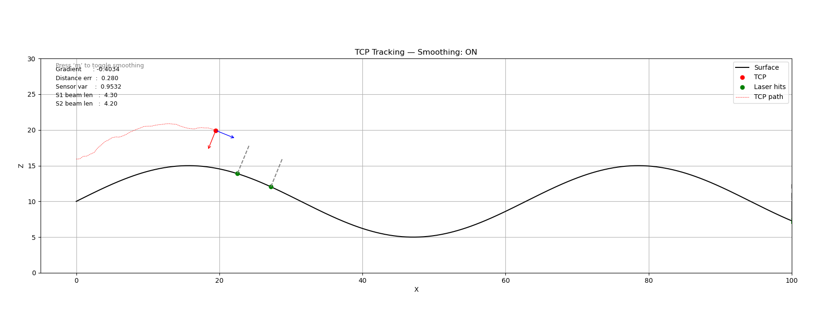
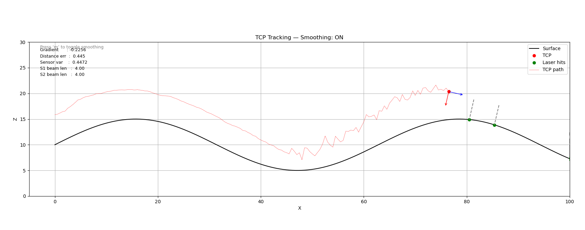

# Two‑Laser Surface‑Tracking Simulator





This repository contains a Python/Matplotlib animation that demonstrates a **feed‑forward surface‑following strategy** for a robotic tool centre point (TCP).  Two forward‑looking laser range measurements are used to:

1. Estimate the local slope of an unknown surface (gradient).
2. Orient the TCP perpendicular to that surface (normal alignment).
3. Maintain a constant stand‑off distance (`target_offset`) above the surface.

---

## Quick Start

```bash
python -m pip install numpy matplotlib
python tcp_sim.py
```

A window opens showing the surface (black), TCP (red), laser beams (grey, terminating in green hit points) and orientation arrows (blue – tangent, red – normal).

Press `` to enable/disable the moving‑average filter applied to each beam measurement.

---

## Algorithm Overview

| Stage                   | Description                                                                                                                                                                                          |
| ----------------------- | ---------------------------------------------------------------------------------------------------------------------------------------------------------------------------------------------------- |
| **Preview sensing**     | Two laser beams are positioned ahead of the TCP along the current surface tangent.  Each beam is projected along the surface normal direction to intersect the surface and returns a height reading. |
| **Gradient estimation** | A straight line is fitted through the two hit points to compute the local surface gradient.                                                                                                          |
| **Orientation**         | The TCP is rotated so its tool axis is aligned with the calculated surface normal.                                                                                                                   |
| **Height command**      | The fitted line is evaluated at the TCP’s current *x*‑coordinate; the TCP *z*‑coordinate is then commanded to `z_surface + target_offset`.                                                           |
| **Filtering**           | An optional moving‑average filter (toggle with `m`) attenuates sensor noise.                                                                                                                         |

---

## Controls

| Key | Function                                 |
| --- | ---------------------------------------- |
| `m`  | Toggle the moving‑average filter on/off. |
|     |                                          |
